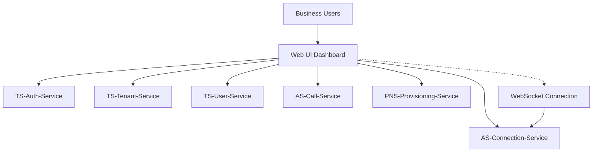
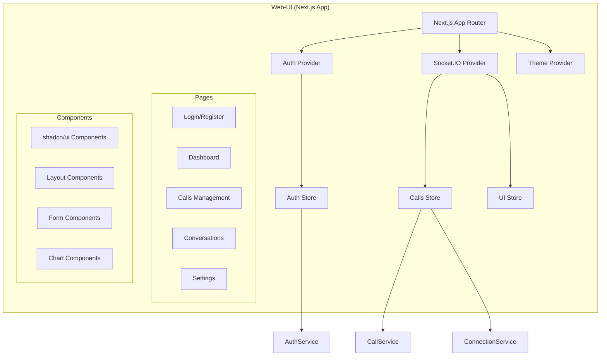

# Web-UI Architecture

## Context Diagram

### Users & Systems

### Service Boundaries
- **Internal**: Customer-facing dashboard for NeverMissCall platform
- **External**: Primary user interface for business call management and analytics
- **Real-time**: WebSocket-enabled dashboard with live updates and notifications

## Components & Data Flow

### Core Components

### Data Flow Patterns
1. **Authentication Flow**: 
   - Login → JWT token → Store token → API client setup → Dashboard access
2. **Real-time Updates Flow**: 
   - WebSocket connection → Event subscriptions → State updates → Component re-renders
3. **Dashboard Data Flow**: 
   - Component mount → API queries → Loading states → Data display → Real-time updates
4. **Form Interaction Flow**: 
   - Form input → Validation → API submission → Success/error handling → State updates

### Component Architecture
- **App Router**: Next.js 14+ app directory structure
- **State Management**: Zustand for global state, React Hook Form for forms
- **Styling**: Tailwind CSS with shadcn/ui component library
- **Real-time**: Socket.IO client for WebSocket connections

## SLOs & Scaling Notes

### Service Level Objectives
- **Availability**: 99.9% uptime (critical for business operations)
- **Latency**: 
  - Page loads: < 2s (P95)
  - API calls: < 1s (P95)  
  - Real-time updates: < 100ms (P95)
  - Form submissions: < 500ms (P95)
- **Throughput**: 
  - 1000 concurrent users
  - 50,000 page views/day
  - 10,000 real-time events/hour
- **Performance**: Lighthouse score > 90 for all core pages

### Performance Characteristics
- **Bundle Optimization**: Code splitting by route and feature
- **Image Optimization**: Next.js Image component with CDN
- **Caching**: API response caching and localStorage persistence
- **Real-time**: Efficient WebSocket connection management

### Scaling Approach
- **CDN Distribution**: Static assets served via CDN
- **Server-Side Rendering**: SSR for improved SEO and initial load
- **Edge Computing**: Edge deployment for global performance
- **Progressive Enhancement**: Core functionality without JavaScript

## Risks & Mitigations

### Technical Risks
| Risk | Impact | Probability | Mitigation |
|------|---------|-------------|------------|
| WebSocket connection drops | Medium | High | Auto-reconnection + fallback polling |
| API service failures | High | Medium | Error boundaries + graceful degradation |
| Bundle size growth | Medium | Medium | Bundle analysis + code splitting |
| Browser compatibility | Low | Low | Progressive enhancement + polyfills |

### User Experience Risks
- **Performance Degradation**: Slow loading affecting user adoption
- **Real-time Lag**: Delayed updates affecting operational efficiency
- **Mobile Experience**: Poor mobile experience reducing accessibility
- **Accessibility**: Non-compliant interface excluding users with disabilities

### Security Risks
- **XSS Vulnerabilities**: Client-side security vulnerabilities
- **Token Management**: Insecure JWT token handling
- **API Exposure**: Accidental exposure of sensitive API endpoints
- **CSRF Attacks**: Cross-site request forgery vulnerabilities

### Mitigation Strategies
- **Security Headers**: Comprehensive CSP and security headers
- **Input Validation**: Client and server-side input validation
- **Error Boundaries**: Graceful error handling with user feedback
- **Performance Monitoring**: Real-time performance monitoring and alerting

## Open Questions

### Architecture Decisions Needed
- [ ] **State Management**: Should we migrate to React Query for server state?
- [ ] **Micro-frontends**: Split dashboard into micro-frontend architecture?
- [ ] **Progressive Web App**: PWA implementation for offline functionality?
- [ ] **Server Components**: Migration to React Server Components?

### User Experience
- [ ] **Mobile App**: Native mobile app development priority?
- [ ] **Offline Support**: Offline functionality requirements and implementation?
- [ ] **Multi-language**: Internationalization and localization support?
- [ ] **Accessibility**: WCAG 2.1 AAA compliance timeline and requirements?

### Performance Optimization
- [ ] **Caching Strategy**: Optimal caching strategy for API responses?
- [ ] **Bundle Optimization**: Further bundle splitting and optimization opportunities?
- [ ] **Image Strategy**: Advanced image optimization and lazy loading?
- [ ] **Edge Deployment**: Edge function utilization for better performance?

### Real-time Features
- [ ] **WebSocket Scaling**: Handling WebSocket connections at scale?
- [ ] **Offline Queue**: Queuing actions when disconnected?
- [ ] **Conflict Resolution**: Handling conflicts in real-time collaborative features?
- [ ] **Push Notifications**: Browser push notifications integration?

### Security & Privacy
- [ ] **CSP Configuration**: Optimal Content Security Policy configuration?
- [ ] **Token Security**: Enhanced JWT token security measures?
- [ ] **API Security**: Client-side API security best practices?
- [ ] **Privacy Compliance**: GDPR and privacy compliance requirements?

### Development Experience
- [ ] **Testing Strategy**: Comprehensive testing approach for React components?
- [ ] **Error Monitoring**: Client-side error monitoring and reporting?
- [ ] **Performance Monitoring**: Real user monitoring vs synthetic monitoring?
- [ ] **Documentation**: Component documentation and design system maintenance?

### Feature Development
- [ ] **Advanced Analytics**: Complex analytics dashboard requirements?
- [ ] **Dashboard Customization**: User-customizable dashboard layouts?
- [ ] **Reporting Features**: Built-in reporting vs external BI integration?
- [ ] **Collaboration Features**: Multi-user collaboration features?

### Integration Requirements
- [ ] **API Integration**: Optimal API integration patterns and error handling?
- [ ] **Third-party Services**: Integration with external services and widgets?
- [ ] **Webhook Dashboard**: Real-time webhook monitoring interface?
- [ ] **Export Features**: Data export and import functionality?

### Business Intelligence
- [ ] **User Analytics**: User behavior analytics and optimization?
- [ ] **Performance Metrics**: Key performance indicators for dashboard success?
- [ ] **A/B Testing**: Framework for feature testing and optimization?
- [ ] **User Feedback**: Integrated user feedback and feature request system?

### Deployment & Operations
- [ ] **CI/CD Pipeline**: Optimal deployment pipeline for Next.js app?
- [ ] **Environment Management**: Multi-environment configuration management?
- [ ] **Monitoring**: Application performance monitoring in production?
- [ ] **Error Recovery**: Automatic error recovery and fallback mechanisms?

### Future Enhancements
- [ ] **Advanced UI**: Next-generation UI frameworks and components?
- [ ] **AI Integration**: AI-powered dashboard features and insights?
- [ ] **Voice Interface**: Voice commands and accessibility features?
- [ ] **AR/VR Support**: Immersive interface capabilities for future use cases?

### Technical Debt
- [ ] **Component Refactoring**: Regular component architecture reviews?
- [ ] **Dependency Updates**: Strategy for keeping dependencies current?
- [ ] **Code Quality**: Automated code quality checks and improvements?
- [ ] **Performance Budgets**: Performance budget enforcement and monitoring?